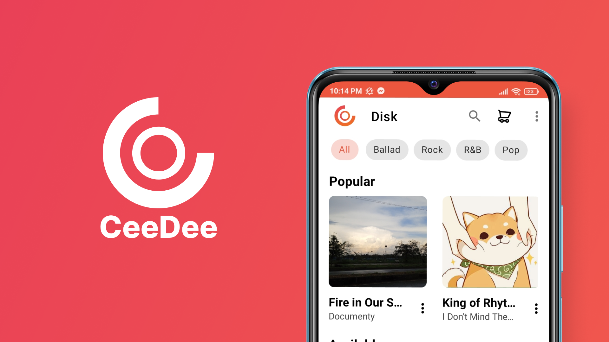

<h1 align="center">
  <br>
  
  <br>
</h1>

<h4 align="center">CD Rental Shop Management Application</h4>

<p align="center">
    
    
    
</p>

<p align="center">
  <a href="#key-features">Key Features</a> •
  <a href="#how-to-use">How To Use</a> •
  <a href="#credits">Credits</a> •
  <a href="#authors">Authors</a> •
</p>



## Key Features
* Managing shop's rentals
* Managing shop's employees
* Managing shop's disks and disk titles
* Stastistics showcase
* Export PDF report
* Automatic push notification

## How To Use

To clone and run this application, you'll need [Git](https://git-scm.com) and [Android Studio](https://developer.android.com/studio/install) installed on your computer. 
You can either clone the project using the terminal:
```bash
# Clone this repository
$ git clone https://github.com/Doan-Pham/CeeDee
```
then open the project in Android Studio. Or you can do the cloning in Android Studio itself following this [guide](https://www.geeksforgeeks.org/how-to-clone-android-project-from-github-in-android-studio/).
Then click Run -> Run 'app' or use the shortcut 'Shift + F10' to start the application


## Credits
This software uses the following libraries and resources:
- Automatic push notification: [Firebase Cloud Functions](https://firebase.google.com/docs/functions)
- Displaying charts and graphs: [MPAndroidChart](https://github.com/PhilJay/MPAndroidChart)
- Icons: [FontAwesome](https://fontawesome.com/icons), [Flaticon](https://www.flaticon.com/icons)

## Authors
  - [**Pham Truong Hai Doan**](https://github.com/Doan-Pham) - *Team Leader*
  - [**Pham Nhut Danh**](https://github.com/bacpro340) - *Contributor*
  - [**Nguyen Tan Huy**](https://github.com/BlockBusterk) - *Contributor*
  
